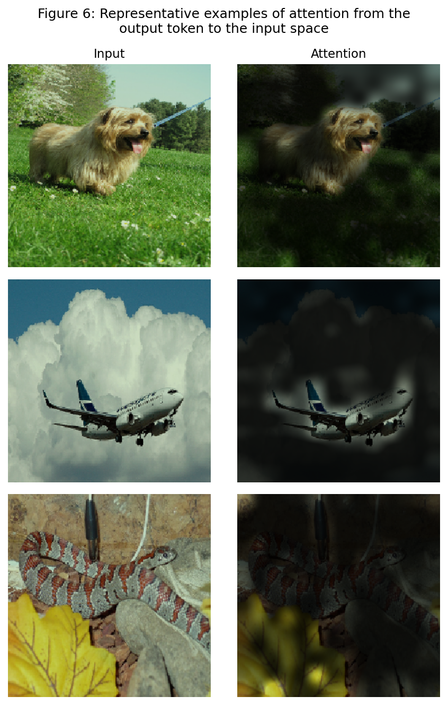
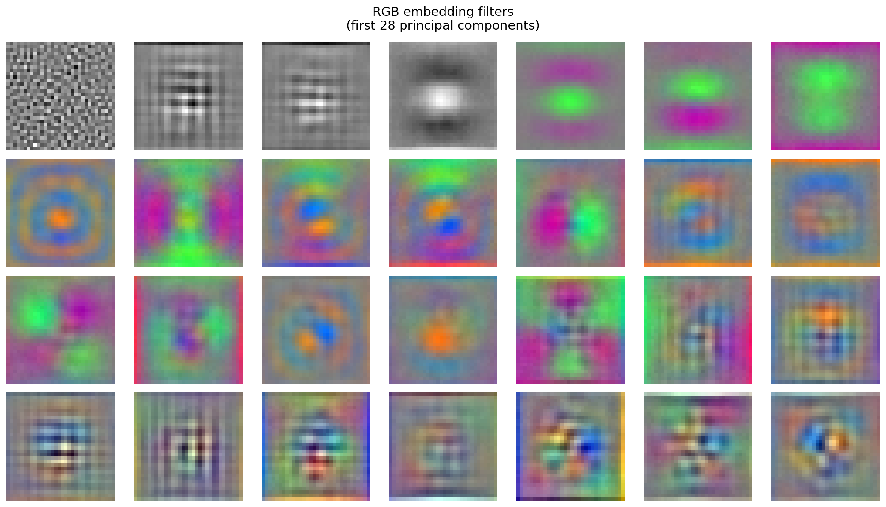
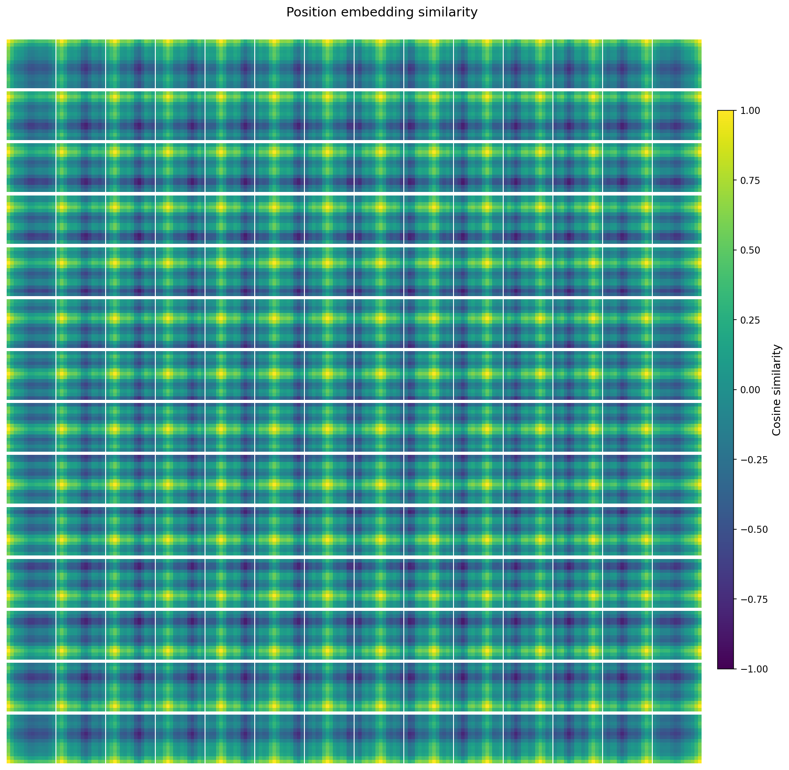
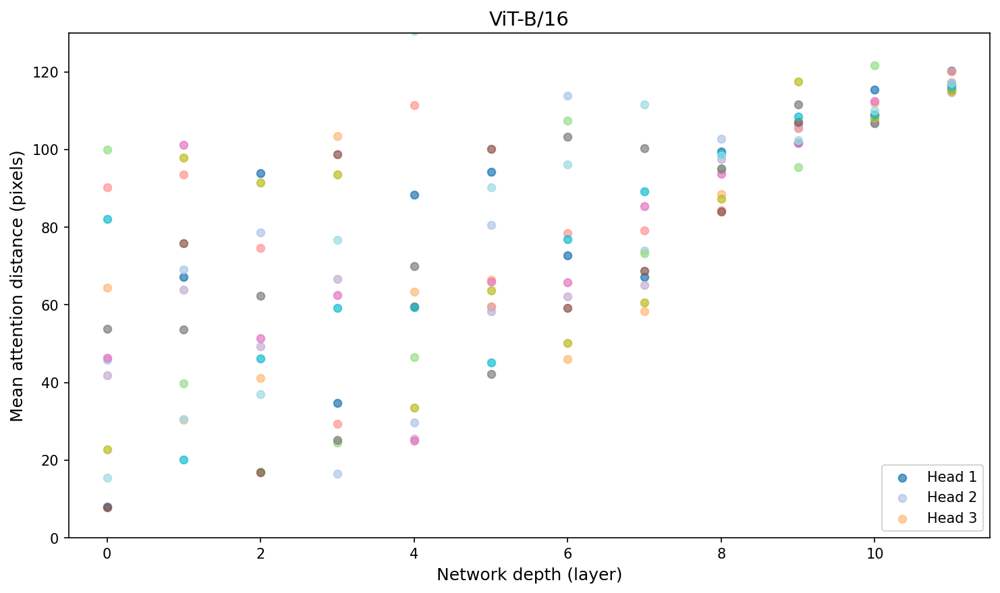

# Vision Transformer Reimplementation


PyTorch reimplementation of a ViT-B/16-style classifier trained from scratch on ImageNet-style data, plus a figure script that reproduces several visualizations from the original Vision Transformer paper.

- Best reported ImageNet top-1 accuracy from `vit.py`: `75.14%`
- Main training entrypoint: `vit.py`
- Main visualization entrypoint: `vit_figures/vit_visualizations.py`

## Setup

```bash
python -m venv .venv
# Windows
.venv\Scripts\activate
# macOS / Linux
# source .venv/bin/activate

pip install -r requirements.txt
```

## Quick Start

### Reproduce the paper-style figures

```bash
python vit_figures/vit_visualizations.py
```

This uses the images in `sample_images/`, downloads pretrained checkpoints when needed, and writes outputs into `vit_figures/`.

### Train the ViT

`vit.py` expects an ImageFolder-style dataset. By default it looks for:

```text
data/imagenet/train
data/imagenet/val
```

You can override the paths with:

- `IMAGENET_TRAIN_DIR`
- `IMAGENET_VAL_DIR`
- `VIT_CHECKPOINT_PATH`
- `VIT_TENSORBOARD_DIR`

Run training with:

```bash
python vit.py
```

Outputs are written to `outputs/checkpoints/` and `outputs/runs/` by default.

## What `vit.py` Implements

`vit.py` is not only a minimal architecture demo. It contains the full training recipe that produced the reported `75.14%` top-1 result:

- ViT-B/16-style patch embedding, class token, learned positional embeddings, and transformer encoder blocks
- RandAugment, Mixup, CutMix, and Random Erasing for stronger data augmentation
- label smoothing and stochastic depth for regularization
- AdamW with warmup + cosine decay
- AMP, gradient accumulation, and gradient clipping for stable practical training
- checkpoint resume and early stopping for long runs

The repository keeps the whole model and training loop in one file on purpose so the architecture and optimization choices are easy to inspect.

## Visualization Script

`vit_figures/vit_visualizations.py` reproduces several classic ViT analyses, including embedding filters, positional similarity, mean attention distance, and attention rollout.

## Visual Summary

### Attention Rollout



This figure makes the model behavior easier to read than raw predictions alone. The attention rollout highlights where the output token is focusing in the image, and in these examples the strongest responses stay on the main object while the background is suppressed.

### Patch Embedding Filters



This view shows what the patch embedding layer has learned at the input stage. It gives a quick intuition for the low-level textures and directional patterns the model uses before self-attention mixes global information.

### Position Embedding Similarity



This heatmap visualizes similarity between learned positional embeddings. Nearby regions tend to stay more related than distant ones, which makes the spatial inductive pattern in the learned representation easier to see.

### Mean Attention Distance



This plot summarizes how far each attention head tends to look across layers. It is a compact way to see that different heads operate at different spatial ranges instead of all behaving the same way.

## License

MIT
